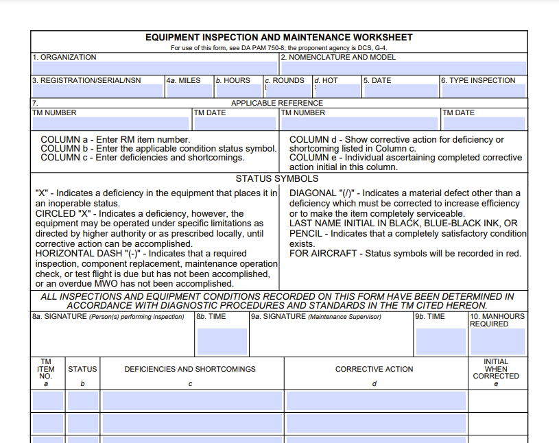

# PDF DA Form Generator

Generates fillable PDF DA Forms via [ReportLab](https://www.reportlab.com/). Fields for documents like the 
[DA Form 2404](./docs/DA2404_Sample.pdf) may be easily filled by providing the corresponding fields to the
[Da2404 Model](da_forms/models.py).



## Installation

Install dependencies using Poetry.

```shell
poetry install
```

## Execution

Generate a form by executing the `generate` script via Poetry.

```shell
poetry run generate
```

## Testing

Execute tests using PyTest.

```shell
poetry run pytest
```

## Dependencies

- Python 3.13
- [Poetry](https://python-poetry.org/)
